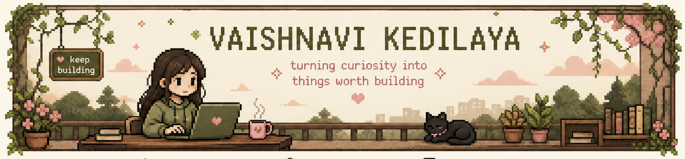

 
<h3>🌿 engineering student · 🎨 creative thinker · 💻 learning by building</h3>

---

## 🌱 ABOUT ME

Hey! I'm **Vaishnavi** 👋
I'm a 3rd year engineering student who enjoys learning by **building, experimenting and creating**.
I'm interested in **programming, AI/ML and creative technology**.
I like taking an idea and turning it into something I can actually see and use.

                                      `learning` ✦ `building` ✦ `experimenting`

---

## 🧰 MY TOOLBOX

<table>
<tr>
<td bgcolor="#D88C8C"><b>🐍 PYTHON</b></td>
<td bgcolor="#7A7B3A"><b>🗄️ SQL / MYSQL</b></td>
<td bgcolor="#D88C8C"><b>⚙️ C</b></td>
</tr>
<tr>
<td bgcolor="#7A7B3A"><b>🌐 HTML</b></td>
<td bgcolor="#D88C8C"><b>🧠 AI / ML</b></td>
<td bgcolor="#7A7B3A"><b>✨ PROMPT ENGINEERING</b></td>
</tr>
<tr>
<td colspan="3" bgcolor="#D88C8C"><b>🐙 GIT & GITHUB</b></td>
</tr>
</table>

---

## 🌱 CURRENTLY LEARNING

<table>
<tr>
<td bgcolor="#D88C8C"><b>REACT</b></td>
<td bgcolor="#7A7B3A"><b>TYPESCRIPT</b></td>
<td bgcolor="#D88C8C"><b>TAILWIND CSS</b></td>
</tr>
</table>
 
Learning these through real projects and experiments — still early in the journey, and that's kind of the point. 🌱

---

## ✨ THINGS I'VE BUILT

### 🌿 Wisply
An accessibility-focused AI agent project exploring how an assistant can understand a user's request, create a plan and help with multi-step tasks.

**Exploring:**
`React` `TypeScript` `Tailwind CSS` `AI Agents`

[View Repo →](https://github.com/kedilayavaishnavi/wisply)

---

### 🎨 Art Gallery Management System
A DBMS mini project for managing an art gallery, including:
- Artists
- Artworks
- Customers
- Exhibitions
- Sales

**Built with:**
`Python` `Tkinter` `MySQL`

---

### 🎮 2D Game
A Mario-inspired 2D game created while experimenting with game development and creative coding.

**Exploring:**
`Game Development` `Creative Coding` `Problem Solving`

[View Repo →](https://github.com/kedilayavaishnavi/super-pixel-adventure)

---

## 🔎 CURRENTLY EXPLORING

`DSA & Algorithms` · `AI / ML` · `Prompt Engineering` · `Open Source` · `Creative Technology`

---

## 🌸 LET'S CONNECT

&nbsp;&nbsp;&nbsp;

  
🌿 **stay curious · keep building · make it meaningful**

